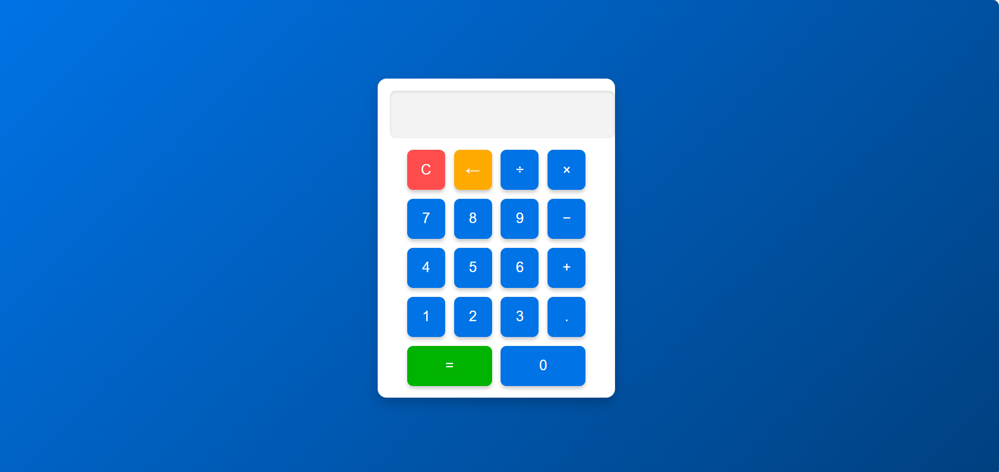

Aqui está um **README.md** que você pode usar para descrever o projeto:

---

# Calculadora Web 💻

Uma calculadora simples e estilosa desenvolvida com HTML, CSS e JavaScript. Esse projeto demonstra como criar uma interface de calculadora funcional e moderna para ser usada diretamente no navegador.

---

## 📋 Funcionalidades

- **Operações básicas**: Adição, subtração, multiplicação, divisão e números decimais.
- **Interface responsiva**: Design adaptável para diferentes tamanhos de tela.
- **Funcionalidades extras**:
  - Limpar (C) para apagar todo o conteúdo do display.
  - Apagar o último caractere (←).
  - Botão "=" para calcular o resultado.

---

## 🎨 Design

- **Plano de fundo**: Gradiente azul moderno.
- **Display**: Estilizado com bordas arredondadas e um leve efeito de profundidade.
- **Botões**:
  - Reagem ao passar o mouse e ao clique.
  - Cores vivas para destacar funcionalidades especiais.
  - Estilo flat e minimalista.

---

## 🚀 Como Usar

1. Clone o repositório ou baixe os arquivos.
   ```bash
   git clone https://github.com/seu-usuario/calculadora-web.git
   ```
2. Navegue até a pasta do projeto.
3. Abra o arquivo `index.html` no navegador.

---

## 📂 Estrutura do Projeto

```
calculadora-web/
├── index.html      # Estrutura HTML
├── styles.css      # Estilo CSS
├── script.js       # Lógica JavaScript
└── README.md       # Documentação do projeto
```

---

## 🛠️ Tecnologias Utilizadas

- **HTML5**: Para a estrutura da página.
- **CSS3**: Para o design e estilos modernos.
- **JavaScript**: Para a lógica de funcionamento da calculadora.

---

## 🖼️ Demonstração

### Visual do projeto:


---

## 💡 Possíveis Melhorias

- Adicionar suporte a teclado para facilitar a entrada de dados.
- Melhorar a responsividade para dispositivos menores.
- Implementar mais operações como exponenciação e raiz quadrada.
- Criar uma versão com memória para salvar cálculos.

---

## 📜 Licença

Este projeto está licenciado sob a [MIT License](LICENSE).

---

## 🤝 Contribuições

Contribuições são bem-vindas! Sinta-se à vontade para abrir issues e pull requests no repositório.

---

Se precisar de ajuda para personalizar ainda mais o **README** ou quiser dicas sobre como hospedar o projeto, é só pedir! 😊
